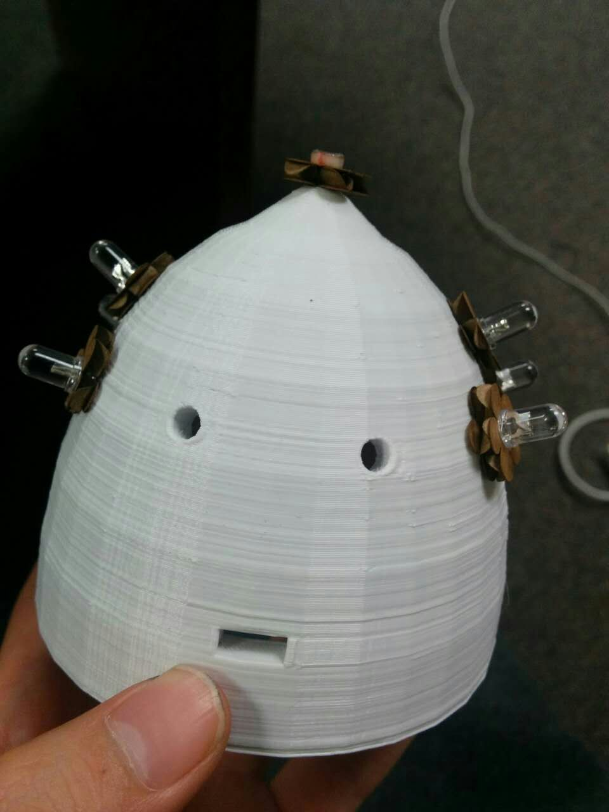
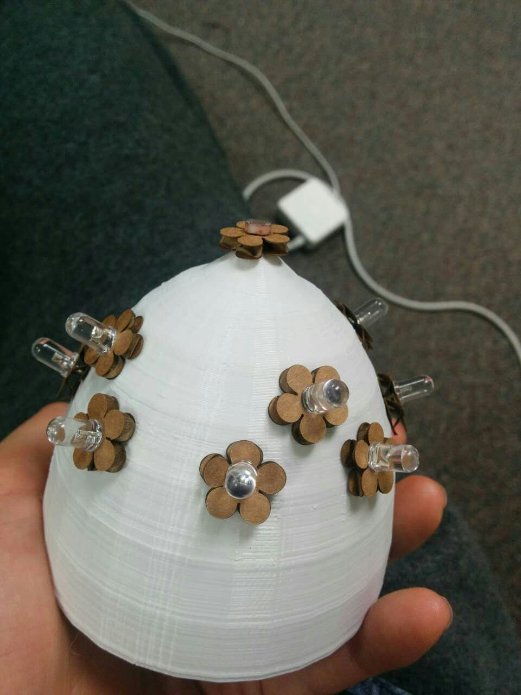
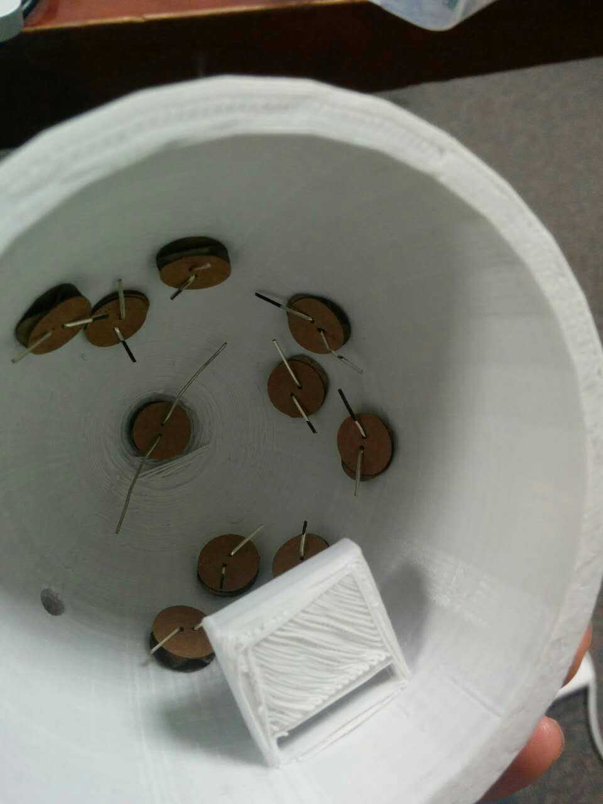
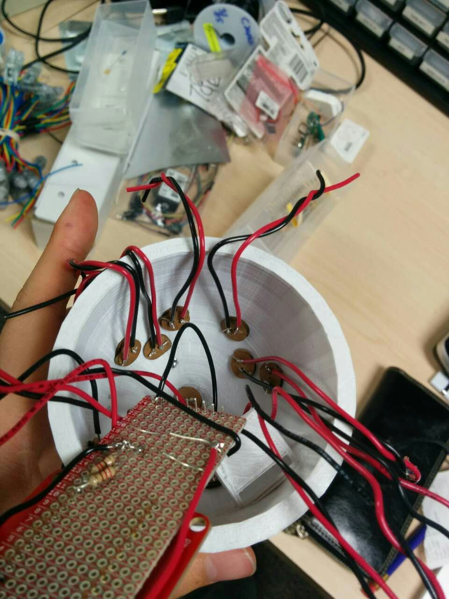

# Lab3
HCIN720 Course Lab3

##description of your case
  - Egg shape robot. 
  - With 9 LED on it. 
  - With an light Sensor on the top 
  - The bottom could hold the battery and photon 
  - Some laser cut flower as decroation 

##the techniques you used
  - 3D printer 
  - laser cutter 
  - soldering  

##and any special features (in the case of A-level)
  - Add click button  
  - Add 9 LED  

##Also include a photo or a short video.

